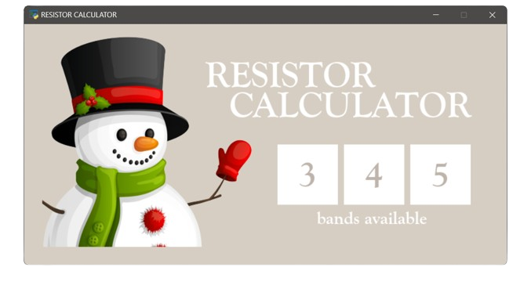
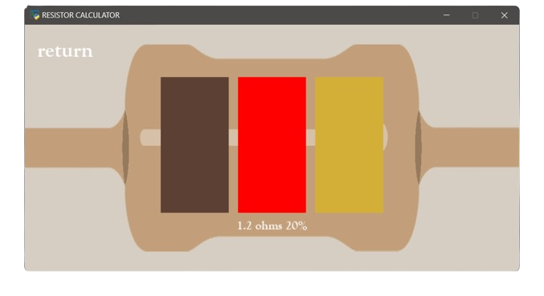

  
  

<h1>Resistor Calculator</h1>

Natalie Wong | 2022

Resistor Calculator is a PyGame GUI designed to calculate resistor values efficiently. 
This project is currently unfinished, future implementations may include:
<ul>
  <li>Performance improvements — eliminate excessive loops and background processes</li>
  <li>Resistor band color labels</li>
  <li>Incorporation of a text field for users to input resistor band colors</li>
  <li>Implementation of a camera module that may allow users to scan and calculate resistor values live</li>
</ul>

Thank you!
